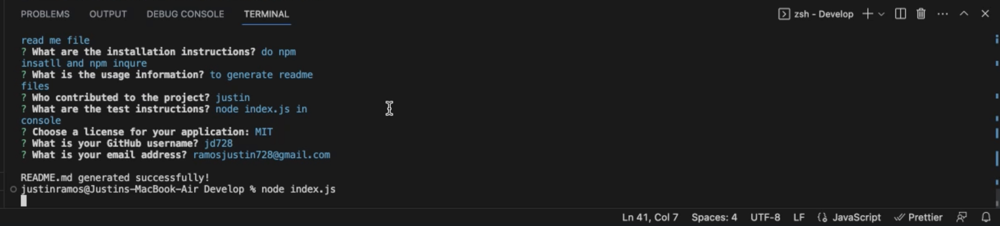
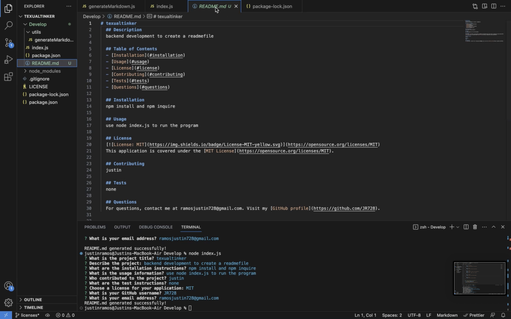
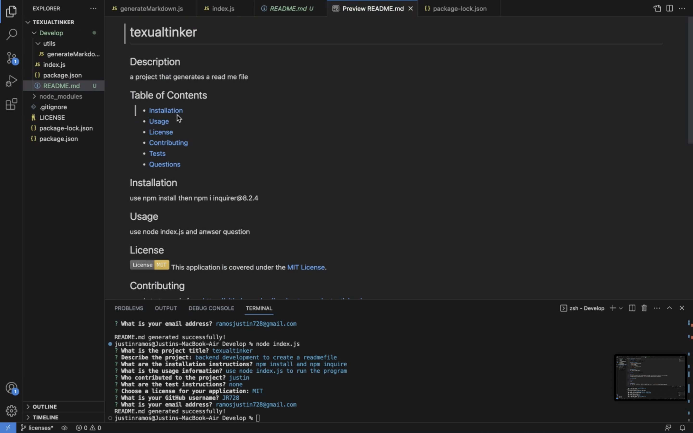

# texualtinker
  ## Description
  This backend development is to create a readmefile that has a description, table of contents, installation, usage, license, conrubiting, tests, and questions headers. The table of contents links takes them to the designated sections.

  ## Images
  Success
  
  Readme code generated
  
  Readme preview
  
  ## Table of Contents
  - [Installation](#installation)
  - [Usage](#usage)
  - [License](#license)
  - [Contributing](#contributing)
  - [Tests](#tests)
  - [Questions](#questions)
  
  ## Installation
  npm install and npm inquire
  
  ## Usage
  use node index.js to run the program
  
  ## License
  
  This application is covered under the [MIT License](https://opensource.org/licenses/MIT).

  ## Contributing
  justin

  ## Tests
  none

  ## Questions
  For questions, contact me at ramosjustin728@gmail.com. Visit my [GitHub profile](https://github.com/JR728).
  
  Video to demonstration https://drive.google.com/file/d/1LsGvmYi9dgKxo0BNV-A8iZuBZArdQafQ/view?usp=drive_link
